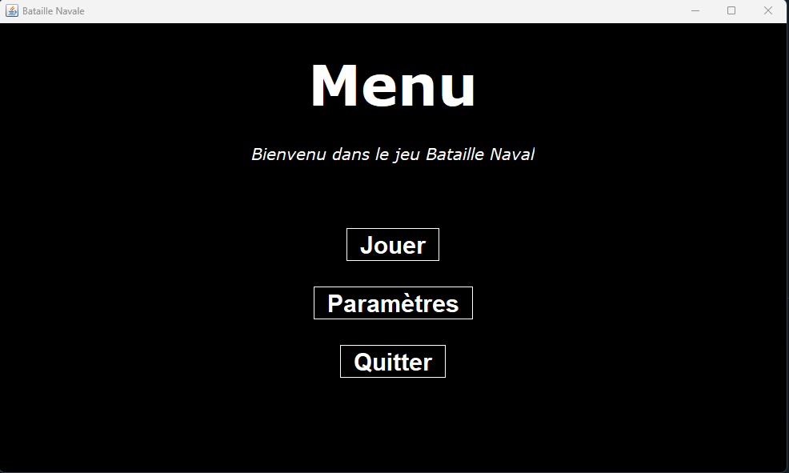
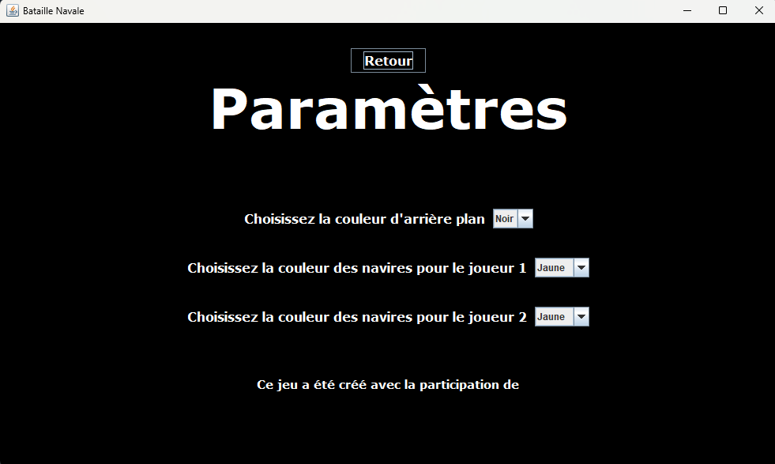
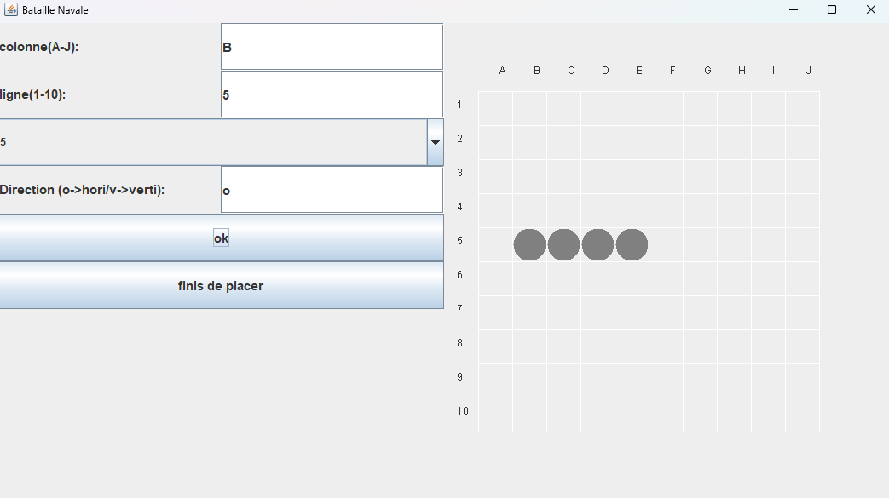
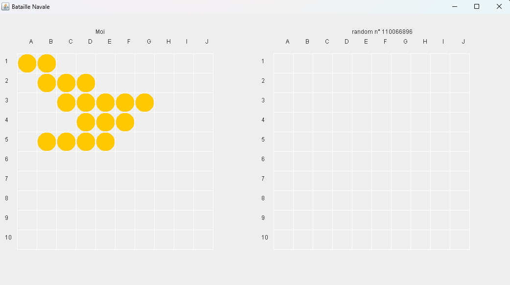
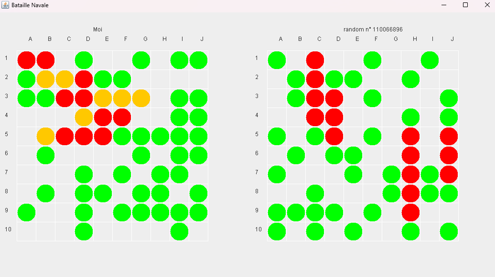
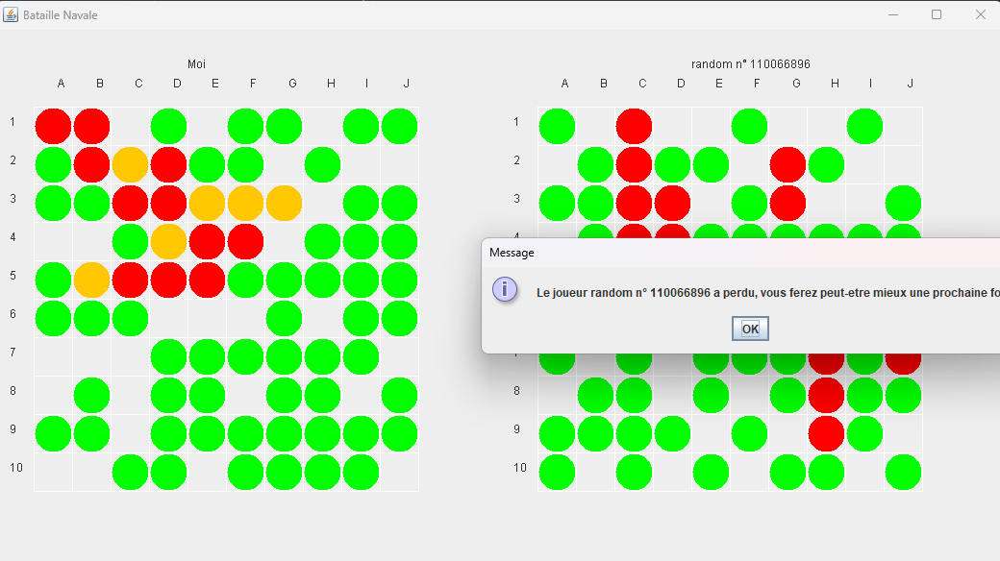
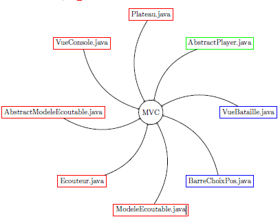

# Bataille naval

Ce projet a été réalisé en 2nd année de licence informatique

### Présentation du projet

A l’issue de ce projet nous avions comme tâche à réaliser un jeu de bataille navale en groupe
de 3 ou 4 étudiants en utilisant le langage Java.
Le but du jeu est de couler tous les navires de l’adversaire en devinant l’emplacement de ses navires sur une grille de coordonnées.  
Les criètres d’évaluation sont diverses, tels que la qualité de l’architecture logicielle et de
notre code. Si notre conception est facile à comprendre c’est-à-dire que la répartition de nos
packages et de nos classes sont cohérente, les noms de classes et de nos méthodes sont éloquents
et que les commenataires sont présents uniquement lorsqu’ils sont utiles.  
Egalement si notre code est facile à maintenir et à faire évoluer notamment s’il n’y à pas de code spaghetti, pas de
code redondant et que le MVC soit mis en oeuvre. Et bien sûr la robustesse de notre code, si
les tests ont été effectués.

Avoir une bonne ergonomie, un design agréable ou bien des options supplémentaires sont
optionnels, ces derniers sont appréciés mais ne composent pas l’essentiel de notre note.
Le code devait être rendu le vendredi 14 avril bien avant 20h00 puisque à 20h00 le code
était extrait de nos dépôts respectifs, donc il est primordiale d’avoir un code fonctionnel qui ne
bug pas.

Nous sommes transparents vis à vis de notre code, nous vous montrons à travers de ce
rapport quel points ont été abordés et ceux qui ne l’ont pas été.

Nous avons réalisé ce projet à 3.

---

### Lancement

Il existe deux façons différentes pour lancer le jeu :

- se placer à la racine de ce README.txt et ouvrer un terminal

- Pour jouer sur la console :
	- lancer la commande suivante : java -jar ./dist/exeConsole.jar

- Pour jouer sur une interface graphique :
	- lancer la commande suivante : java -jar ./dist/exeGraphique.jar

--- 

### Aperçu jeu version graphique

#### **Le menu**

Le menu principal et le menu paramètre sont de couleurs sobres qui permettent de mettre en
valeur les éléments clés de notre interface utilisateur.   
Nos boutons sont également intéractifs qui sont essentiel pour permettre aux utilisateurs 
d’intéragir avec nos menus de manière intuitive.  

Pour que les boutons soit intéractifs et efficaces, nous avons fait de sorte que lorsqu’ils ne
sont pas survoler par la souris elles ont un text blanc en gras sur un fond noir avec une bordure
blanche pour inciter l’utilisateur à venir vers eux, et lorsque la souris survole un
de nos boutons, le texte devient alors noir gras sur un fond rouge avec une bordure également
rouge.

Comme le montrent les deux images ci-dessous, l’objectif de cette démarche est d'inciter l'utilisateur à interagir avec le bouton survolé en l'incitant à cliquer dessus. Ce processus attire l’attention sur le bouton et lui confère un aspect plus dynamique.

Cette technique vise à améliorer l'expérience utilisateur en offrant une indication visuelle claire de l’interaction possible avec cet élément. En différenciant visuellement les éléments interactifs de ceux qui ne le sont pas, on aide l’utilisateur à naviguer de manière plus intuitive.

#### **Les paramètres**

Lorsque le joueur est au menu paramètre, seul la modification des backgrounds des menus
est pris en compte mais pour les couleurs des navires du joueur 1 et joueur 2, ils ne sont pas
pris en considération pour le moment.   
 Les modifications de couleurs contribuent également à rendre l’interface plus claire et agréable à utiliser.

#### Aperçu jeu

Avant le début de la partie vous devez placer vos bateaux sur la grille:

Une partie après avoir placer les bateaux commence de cette façon:

Le joueur est à gauche, l'ordinateur est à droite.

Voici une partie à un stade avancé:

Voici ce qu'il se passe lorsque tout les navires d'un des 2 camps sont coulés:

Il est néamoins dommage qu'il n'y ai pas un meilleurs affichage de fin et la possibilité de retourner au menu principale. Si nous avions eu plus de temps nous l'aurions fait.

### Partie console

La partie console du programme est simple d’utilisation mais en contrepartie, elle n’est
pas rapide à compléter, notamment la partie dans laquelle nous plaçons nos bateau.    
La partie Graphique du programme est simple est rapide à utilisé.    
Un aspect négatif du programme est qu’il est impossible de différencier un bateau touché d’un bateau coulé.

### Maintenabilité et évolution facile du code

#### **MVC** 
La mise en oeuvre du MVC se fait par différent fichiers réparties dans divers packages, les
voici à travers cette image :

Quelque détail sur cette image, les fichiers java encadré en rouge sont présent dans le package
game, ceux en vert dans players et en bleu dans le package graphique.

Le modèle **MVC** qui est un acronyme voulant dire **Modèle-Vue-Contrôleur** est un modèle
de conception utilisé dans le développement de logiciels pour séparer la logique de présentation
(vue) de la logique de traitement (modèle) et des actions utilisateur (contrôleur).

Le plateau hérite de la classe AbstractModeleEcoutable pour mettre à jour le plateau à
chaque fois qu’un bateau ou un obus est placé sur la grille ce qui permet de ne pas avoir de
problème sur l’actualité des informations visible sur le plateau.

Pour ce qui est de la classe VueConsole ou VueBataille, elles implémentent toute les deux la
classe Ecouteur puisqu’il est nécessaire d’ajouter un ecouteur au plateau utilisé dans ces deux
classes si nous souhaitons ce que nous affichons que ce soit sur la partie console ou la partie
graphique soit bien ce qui a été mis à jour.

La classe BarreChoixPos implémente un ecouteur pour mettre à jour le plateau affiché à
chaque fois qu’un bateau est placé sur la grille.

#### **Redondance**

Nous avons du code redondant notamment entre la partie graphique et la partie console,
ces deux derniers ont quelque fonctions similaire, la factorisation est possible mais risque de
prendre un certain temps, donc elle n’est pas implémenter, du moins pour l’instant.

#### **Robustesse**

Un code qui à des tests est un code qui garantie la qualité et la robustesse du jeu, les tests
permettent d’identifiers les erreurs et les failles dans le code ce qui reste du moins essentiel.   

Pour notre code, de nombreux test unitaires ont été effectués manuellement cepandant aucun test
automatique n’on été mis en place il est donc impossible de garantir que ce jeu est complètement
incassable.  

L’interface player nous donne une certaine modularité puisqu’elle nous permet d’implémenter
rapidement et facilement des nouveaux types de joueurs.

### Sources

- https ://www.unicaen.fr/universite/decouvrir/logo-unicaen-usages/
- https ://www.repro-tableaux.com/a/elliott-william/bataille-de-mer-entre-nav.html